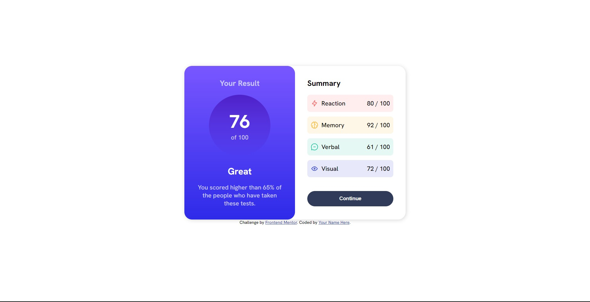

# Frontend Mentor - Results summary component solution

This is a solution to the [Results summary component challenge on Frontend Mentor](https://www.frontendmentor.io/challenges/results-summary-component-CE_K6s0maV). Frontend Mentor challenges help you improve your coding skills by building realistic projects. 

## Table of contents

- [Overview](#overview)
  - [Screenshot](#screenshot)
  - [Links](#links)
- [My process](#my-process)
  - [Built with](#built-with)
  - [Continued development](#continued-development)
- [Author](#author)

## Overview

### Screenshot

### Links

- Solution URL: [Solution](https://github.com/Sarang837/results-summary-component-main)
- Live Site URL: [Live Site URL](https://sarang837.github.io/results-summary-component-main/)

## My process

### Built with

- Semantic HTML5 markup
- CSS custom properties
- Flexbox

### Continued development

To make the site responsive, I plan to use CSS media queries to adjust the layout and styling of the site based on the device's screen size. I will also pay close attention to the user experience, ensuring that the site is easy to use and navigate on all devices.

## Author

- Website - [Sarang Desai](https://github.com/Sarang837)
- Frontend Mentor - [@Sarang837](https://www.frontendmentor.io/profile/Sarang837)
